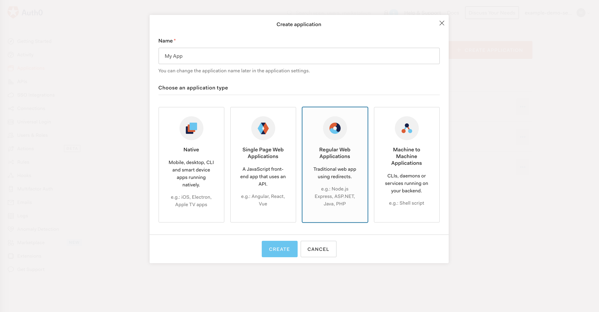
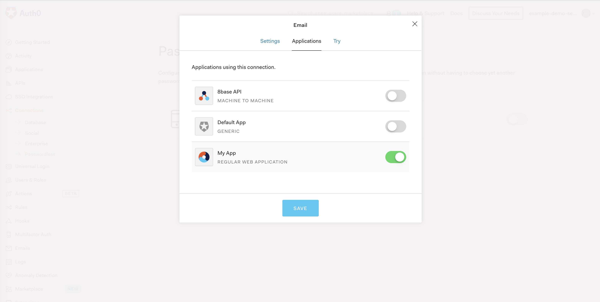
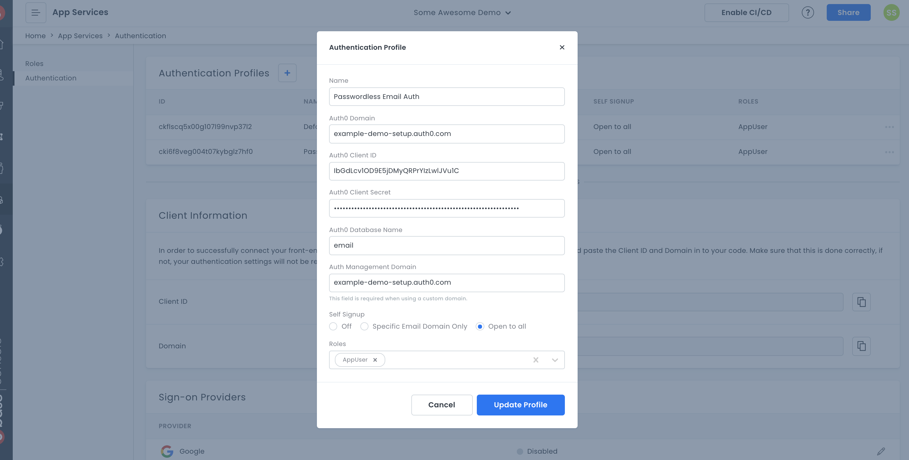
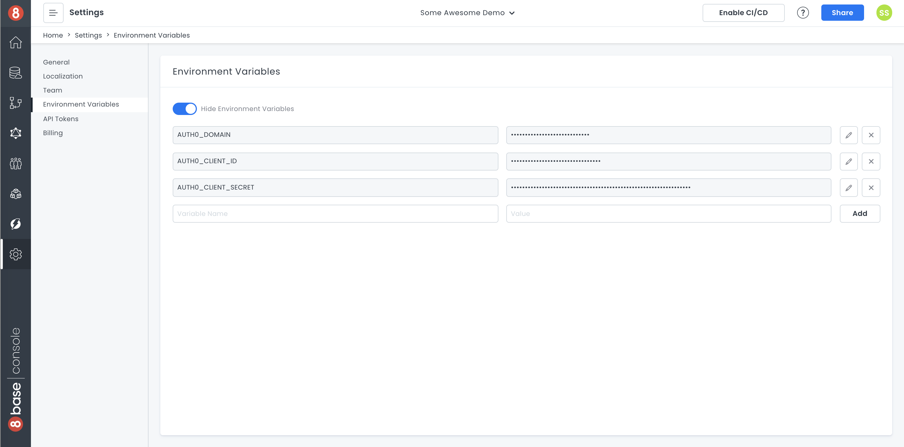

# Setting Up Auth0 OTP Authentication with an 8base Workspace

Depending on the type of application you are building, you may want to utilize a different authentication strategy than basic email and password forms. This decision can be for the sake of security, UX, as well as a myriad of other reasons. That said, it's important that you choose a tech-stack that gives you the flexibility to use whichever authentication strategy you decide on.

Given that the 8base API accepts ID Tokens (JWT) issued by any OpenID compliant auth provider, you have a ton of flexibility how you'd like to implement your user authentication strategy. As long as the chosen auth provider is configured in 8base using an authentication profile, the 8base API will be able to publicly verify incoming tokens and securely validate incoming requests.

In this tutorial, we're going to demonstrate a strategy for enabling One-time Passcode (OTP) authentication using [Auth0](https://auth0.com) to work with an 8base workspace API.

## Getting started with OTP Authentication

To get started, you're going to need the following:

1. An Auth0 account - [Sign up here](https://auth0.com/signup)
2. An 8base account - [Sign up here](https://app.8base.com)
3. The 8base CLI installed - Run `npm install --global 8base-cli` OR `yarn add global 8base-cli`

Got it? Good! Let's hop right in.

## Creating an Auth0 Application with OTP Enabled

The first thing we're going to want to do is create a new application in Auth0. So in the *Applications* page of your Auth0 account, go ahead and click the "+ CREATE APPLICATION" button. All we're going to do is give our application a name, like "My App", and select "Regular Web Applications".



Regardless of the type of application you are building, make sure that you choose "Regular Web Application". Auth0 doesn't allow Passwordless OTP for all application types, and Regular Web Application will work for the serverless functions we're going to deploy to our backend for handling auth.

Once created, navigate to the *Settings* tab of your application and scroll all the way to the bottom of the page till you find the *Show Advanced Settings* button. Open it and in the *Grant Types* tab make sure that Passwordless OTP is checked, and save your changes if you're updating it!

Next, navigate to the *Connections* sections of the left menu and select *Passwordless*. Go ahead and enable "Email". In the form that pops up, you can customize the outgoing email; leave it as the default for now. However, make sure that Email OTP is enabled for your application in the *Applications* tab. If not, you'll receive a client unauthorized error!



This is actually all we're going to need to do on the Auth0 side of things! So let's move on to setting up our 8base resources.

## Creating an Authentication Profile for Passwordless OTP in 8base

We're going to now want to set up an [*Authentication Profile*](https://docs.8base.com/docs/8base-console/authentication#your-own-auth0-account) in 8base so that our API knows how to verify incoming ID tokens.

There are only a few steps required to set up your Auth0 account on 8base. First, navigate to the `App Services > Authentication` of your workspace and create a new Authentication Profile. In the form that appears, select Your Auth0 Account. All required information is in the *Settings* page of your Auth0 Application, and for the Auth0 Database Name we're going to want to input "email".

**If you're not using a custom domain on Auth0, leave the management field blank.**



After filling in your Auth0 application's credentials, go ahead and select "Open to all" so that sign-up is not restricted, as well as select the *Guest* role for Roles. This means that a user signing up will automatically be assigned the Guest role.

Now, we're going to want to add some of the same keys and credentials as [Environment Variables](https://docs.8base.com/docs/development-tools/dev-env/runtime-environment#environment-variables) in our workspace. This is so the functions we deploy can securely access these protected keys that we're going to need at runtime. 

To accomplish this, we're going to navigate to *Settings > Environment Variables* and create the following keys/value pairs.

1. `AUTH0_CLIENT_SECRET` - Your Application's client secret.
2. `AUTH0_CLIENT_ID` - Your Application's client id.
3. `AUTH0_DOMAIN` - Your Auth0 domain.
4. `AUTH_PROFILE_ID` - Your 8base Authentication Profile ID.



Once done, we're ready to navigate over to our CLI and set up the functions!

## Developing serverless functions for Passwordless OTP

The first thing that we'll want to do is create the directory and files for all our code. Let's knock it out with a few commands.

```sh
# Authenticate your 8base CLI if not already done
8base login

# Create a new 8base project and connect it to your workspace
8base init passwordless-otp --empty

# Generate resolver for initiating passwordless auth
8base generate resolver passwordlessAuthStart --syntax=js

# Generate resolver for verifying auth code and returning token
8base generate resolver passwordlessAuthLogin --syntax=js

# Generate utils folder with shared script files.
mkdir src/utils && touch src/utils/auth0.js src/utils/graphql.js
```

Nice! That should have gone ahead and generate most of the template we need to move fast. That said, all that did actually happen was some boilerplate code/files were added to our `src/resolvers` directory and `8base.yml` file. We'll be updating all of them.

### src/utils/auth0.js

The Auth0 docs are pretty intimidating... That said, we're going to be utilizing two of their endpoints for OTP.

Let's update the `src/utils/auth0.js` file with the following code which has in code comments explaining what's happening. We'll be importing this exported module into our other functions.

```js
/* Import your preferred HTTP client */
import axios from 'axios'

/* Access the environment variables we stored in 8base */
const domain = process.env.AUTH0_DOMAIN
const client_id = process.env.AUTH0_CLIENT_ID
const client_secret = process.env.AUTH0_CLIENT_SECRET

/* Export default module with auth methods */
export default {
  /**
   * Initiate the OTP flow by sending user an email or link
   * with a one-time passcode.
   *
   * Endpoint Docs: https://auth0.com/docs/connections/passwordless/reference/relevant-api-endpoints#post-passwordless-start
   */
  otpStart: async (email, send = 'code') => {
    return axios.post(`https://${domain}/passwordless/start`, {
      connection: 'email',
      client_secret,
      client_id,
      email,
      send
    })
  },
  /**
   * Verify an issued token with the username (email)
   * and receive back the auth result.
   *
   * Endpoint Docs: https://auth0.com/docs/connections/passwordless/reference/relevant-api-endpoints#post-oauth-token
   */
  tokenVerify: async (username, otp) => {
    return axios.post(`https://${domain}/oauth/token`, {
      grant_type: 'http://auth0.com/oauth/grant-type/passwordless/otp',
      realm: 'email',
      client_secret,
      client_id,
      username,
      otp
    })
  }
}
```

### src/utils/graphql.js

There are several GraphQL requests that we'll need to make during our authentication flows. Let's add each of them to the `src/utils/graphql.js` file.

```js
import gql from 'graphql-tag'
/**
 * Create a user record in 8base using a valid ID token
 */
export const USER_SIGN_UP_WITH_TOKEN = gql`
  mutation($authProfileId: ID!, $email: String!) {
    userSignUpWithToken(
      authProfileId: $authProfileId
      user: { email: $email }
    ) {
      id
    }
  }
`
/**
 * Query a user using their email address.
 */
export const FIND_USER_BY_EMAIL = gql`
  query users($email: String) {
    usersList(filter: { email: { equals: $email } }) {
      count
    }
  }
`
```

### passwordlessAuthStart

When writing resolver functions, we must write the GraphQL schema, a handler function, and any desired mocks for local testing.

#### src/resolvers/passwordlessAuthStart/schema.graphql

In order to start the OTP flow, we'll allow the developer to submit a user's email address and an OTP type ("code" or "link") as inputs and return back a simple boolean success response.

```graphql
type PasswordlessAuthStartResult {
  success: Boolean!
}

extend type Mutation {
  # Declare GraphQL mutation inputs and response
  passwordlessAuthStart(email: String!, type: String): PasswordlessAuthStartResult
}
```

#### src/resolvers/passwordlessAuthStart/handler.js

The `otpStart` method we declared in our `src/utils/auth0.js` module is going to do most of the work here. However, let's go ahead and import it and make sure that we're correctly accessing our resolver inputs and response objects.

```js
import auth0 from '../../utils/auth0'

/* Send a password reset email to the user */
export default async event => {
  /* Unpack event data */
  const { email, type = 'code' } = event.data

  try {
    /* Initiate the authentication flow by sending OTP email */
    await auth0.otpStart(email, type)
  } catch (error) {
    /* Console error to logs */
    console.error(error)

    /* Return failure and error */
    return {
      data: {
        success: false
      },
      errors: [error]
    }
  }

  /* Return success result */
  return {
    data: {
      success: true
    }
  }
}
```

#### src/resolvers/passwordlessAuthStart/mocks/request.json

In terms of local testing, we'll be able to use a mock to stub the `event` argument that's passed to our function. Let's update this functions mock with the following so we can test the flow using your own email address. 

```json
{
  "data": {
    "email": "<YOUR_EMAIL_ADDRESS>"
  }
}
```

Nice job! With all this set up, let's go ahead and test our function using the CLI. However, before doing that we're going to need a way of access our environment variables locally.

Create a file in your `server` directory name `.env.local` and make sure you ignore it from Git! Once created, add the following keys to it with your own values.

```txt
AUTH0_DOMAIN=<YOUR_AUTH0_DOMAIN>
AUTH0_CLIENT_ID=<YOUR_AUTH0_CLIENT_ID>
AUTH_PROFILE_ID=<YOUR_AUTH_PROFILE_ID>
AUTH0_CLIENT_SECRET=<YOUR_AUTH0_CLIENT_SECRET>
```

Once done, we'll be able to access these values and environment variables when running our commands!

```sh
$ env $(cat .env.local | xargs) 8base invoke-local passwordlessAuthStart -m request

=> Result:
{
  "data": {
    "success": true
  }
}
```

If the success message was returned `true`, go ahead and check your inbox! You should have a code waiting for you. All we have to do now is set our resolver for verifying the code...

### passwordlessAuthLogin

Let's write the GraphQL schema, a handler function, and mocks for our `passwordlessAuthLogin` resolver.

#### src/resolvers/passwordlessAuthLogin/schema.graphql

For the login resolvers schema we're going to want to return an auth result. We can simply use the same object as is returned from the `auth0/token` endpoint and nest it in our success response.

```graphql
# Auth0 token response object
type AuthResult {
  expires_in: Int
  id_token: String
  token_type: String
  access_token: String
  refresh_token: String
}
# Login response object
type PasswordlessAuthLoginResult {
  success: Boolean!
  auth: AuthResult
}

#  Mutation accepts email and code inputs
extend type Mutation {
  passwordlessAuthLogin(email: String!, code: String!): PasswordlessAuthLoginResult
}
```

#### src/resolvers/passwordlessAuthLogin/handler.js

To verify the token, we're going to need to use our `auth0` modules `tokenVerify` method. Additionally, if the token is valid but the user doesn't yet exist in our 8base user's table, we'll wan to automatically create the user record.

```js
import auth0 from '../../utils/auth0'
import { USER_SIGN_UP_WITH_TOKEN, FIND_USER_BY_EMAIL } from '../../utils/graphql'

/* Declare static constants */
const noPermissions = { checkPermissions: false }
const authProfileId = process.env.AUTH_PROFILE_ID

export default async (event, ctx) => {
  /* Unpack event data */
  const { email, code } = event.data

  /* Set default response values */
  let success = true
  let auth = {}

  try {
    /* Validate email and code */
    ;({ data: auth } = await auth0.tokenVerify(email, code))

    /* Find user record stored in 8base by email */
    let {
      usersList: { count }
    } = await ctx.api.gqlRequest(FIND_USER_BY_EMAIL, { email }, noPermissions)

    /**
     * If the user doesn't exist, create the user
     * using the issued token, email, and authProfileId.
     */
    if (count) {
      await ctx.api.gqlRequest(
        USER_SIGN_UP_WITH_TOKEN,
        {
          authProfileId,
          email
        },
        {
          headers: {
            /* Set the issued token as a bearer token in headers */
            authorization: `Bearer ${auth.id_token}`
          }
        }
      )
    }
  } catch (error) {
    /* Console error to logs */
    console.error(error)

    /* Return failure and error */
    return {
      data: {
        success: false
      },
      errors: [error]
    }
  }

  /* Return success and auth result */
  return {
    data: {
      success,
      auth
    }
  }
}
```

#### src/resolvers/passwordlessAuthLogin/mocks/request.json

To test this function we'll need to update the mock file with the following object. Remember that it will expect a valid code! So you'll need to test the functions sequentially.

```json
{
  "data": {
    "email": "<YOUR_EMAIL>",
    "code": "<YOUR_OTP_CODE>"
  }
}
```

Once updated, let's go ahead and get our auth result! Your first OTP code may have expired by now, so make sure to test the `passwordlessAuthLogin` again and then input the fresh code in the `passwordlessAuthLogin/mocks/request.json` file.

```sh
$ env $(cat .env.local | xargs) 8base invoke-local passwordlessAuthLogin -m request

=> Result:
{
  "data": {
    "success": true,
    "auth": {
      "expires_in": 86400,
      "token_type": "Bearer",
      "scope": "openid profile email address phone",
      "access_token": "2L7f_9xf3hNp4bdkhdig38yg388yg8g8",
      "id_token": "eyJhbGciOiJSUzI1NiIsInR5cCI6Ikp.someTOKEN.XVCIsImtpZCI6IkJ0ZzQxWFVvNE1iQTZuWXZlQ1Np"
    }
  }
}
```

## Deploying our Passwordless OTP Auth

Since everything is working locally, let's go ahead and deploy our code to the production environment. Once deployed, we'll need to update our `Guest` role so that these functions are publicly available! Also, we'll be able to test them live.

Go ahead and deploy the functions.

```sh
$ 8base deploy

=> deploy done. Time: 23,598 ms.
```

Once deployed, head over to your 8base workspace and navigate to *App Services > Roles > Guest* and click on the *APPS* tab. At the bottom of the tab, you'll find API permissions. Make sure that both of the functions we deployed are checked. Doing so will ensure that an unauthenticated web request (someone trying to login) can invoke these functions.

Now with everything set up, let's test our functions using the 8base API Explorer or another GraphQL client!

### Passwordless Auth Start

**Query**
```graphql
mutation {
  passwordlessAuthStart(email: "<YOUR_EMAIL>") {
    success
  }
}
```

**Response**
```json
{
  "data": {
    "passwordlessAuthStart": {
      "success": true
    }
  }
}
```

Go check your email to obtain the code for testing the Login mutation.

### Passwordless Auth Login

**Query**
```graphql
mutation {
  passwordlessAuthLogin(
    email: "<YOUR_EMAIL>",
  	code: "<SOME_CODE>"
  ) {
    success
    auth {
      refresh_token
      access_token
      expires_in
      token_type
      id_token
    }
  }
}
```

**Response**

```json
{
  "data": {
    "passwordlessAuthLogin": {
      "success": true,
      "auth": {
        "refresh_token": "some_refresh_token",
        "access_token": "some_access_token",
        "expires_in": 86400,
        "token_type": "Bearer",
        "id_token": "some.valid.idtoken"
      }
    }
  }
```

Now that you have a valid ID Token, you can include it as an authorization header's `Bearer` token to authenticate your requests to the GraphQL API! Additionally, if you want to refresh the user's ID token without requiring them to authenticate, you can store the _refresh_token_ and later use it with the `userRefreshToken` mutation.

```graphql
mutation {
  userRefreshToken(data: {
    email: "<USER_EMAIL>"
    refreshToken: "<ISSUED_REFRESH_TOKEN>"
    authProfileId: "<YOUR_AUTH_PROFILE_ID>"
  }) {
    refreshToken
    idToken
  }
}

```

## Conclusion

I hope that you found this tutorial helpful for setting up Passwordless OTP using Auth0 and 8base! Additionally, I hope that it helped you better understand how user authentication can be handled separately from a application backend with valid ID tokens being used to authenticate API requests. 

If you have any questions or suggestions, please let me know! Thank you.
